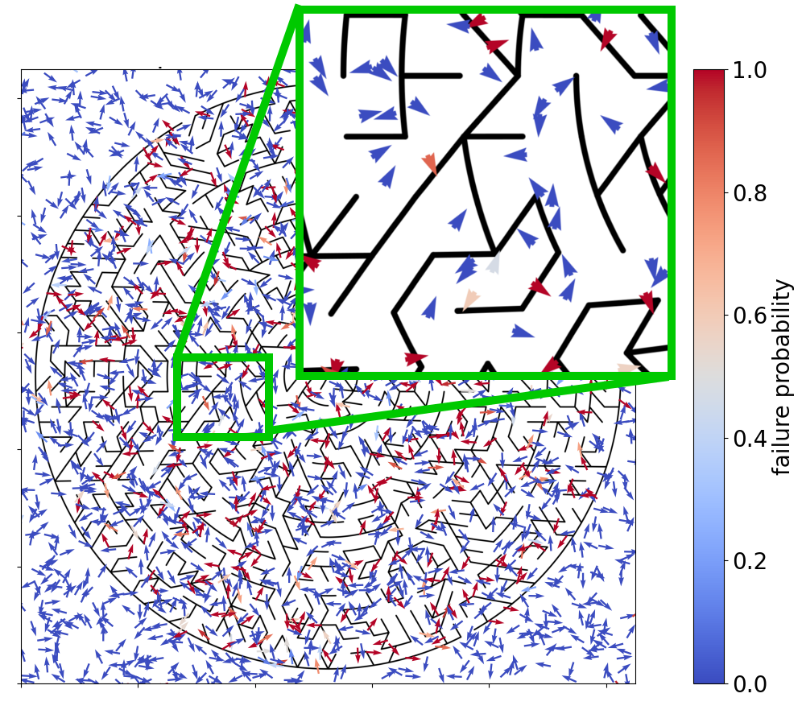

# PYRMM: (Learned) Risk Metric Maps in Python

## Overview



The pyrmm library is used for development of neural network models that predict risk (e.g. probability of failure) for kinodynamic systems (e.g. cars, airplanes, etc.)

## Citation

TODO

### Reproduction of Paper Results

Please see instructions in the [`experiments` sub-package](https://github.com/mit-drl/pyrmm/tree/master/experiments#readme)

## Disclaimer

Research was sponsored by the United States Air Force Research Laboratory and the United States Air Force Artificial Intelligence Accelerator and was accomplished under Cooperative Agreement Number FA8750-19-2-1000. The views and conclusions contained in this document are those of the authors and should not be interpreted as representing the official policies, either expressed or implied, of the United States ​Air Force or the U.S. Government. The U.S. Government is authorized to reproduce and distribute reprints for Government purposes notwithstanding any copyright notation herein.

## Installation

Due to several 3rd party non-Python dependencies, the install process is somewhat involved and manual.

The installation process is written for an Ubuntu Linux machine.

It is __strongly__ recommended to use a conda environment to manage the installation. These instructions only cover a conda environment installation process.

### Clone and Conda Env

```bash
git clone --recurse-submodules git@github.com:mit-drl/pyrmm.git
cd pyrmm

# creates a conda env called pyrmm, this may take a while
conda env create -f environment.yml 
conda activate pyrmm

# build the mazegenerator submodule used for procedurally
# generating 2D maze images
cd mazegenerator/src
make

# build the V-HACD library used to create convex decompositions of procedurally generated 
# rooms
cd ../v-hacd/app/
cmake -DCMAKE_BUILD_TYPE=Release CMakeLists.txt
cmake --build .
```

### Install OMPL with Python Bindings

Next we will download and install OMPL following the [OMPL install instructions](https://ompl.kavrakilab.org/core/installation.html). 

We use the [Open Motion Planning Library (OMPL)](https://ompl.kavrakilab.org/core/index.html) for it's state and control space definitions and sampling functions. OMPL is a C++ library but provides python bindings that must be built by running an installation script. These instructions were written when [ompl 1.5](https://github.com/ompl/ompl/releases/tag/1.5.0) was the most recent release, but now [ompl 1.6](https://github.com/ompl/ompl/releases). The install process *should* be the same for ompl 1.6, but it hasn't been tested.

```bash
# Download OS-specific script from https://ompl.kavrakilab.org/core/installation.html
# For ubuntu, the next steps look like
chmod u+x install-ompl-ubuntu.sh
./install-ompl-ubuntu.sh --python # this will install the latest release of OMPL with Python bindings
```

> :warning: **Troubleshooting**
> The python bindings can take __hours__ to build. It is [recommended to use PyPy3](https://github.com/ompl/ompl/issues/699#issuecomment-961580319) to speed up the process, but these instructions don't go into the level of detail needed to walkthrough PyPy3 vs CPython

The above steps should install ompl to your home directory, e.g. `/home/user/ompl-1.5.2/`. The python bindings are not immediately "discoverable" by python; we need to point the conda environment to the ompl install using a `.pth` file. Assuming your conda environment is stored in `~/miniconda3/envs/pyrmm`, you run something similar to (adjusting paths as need to match install locations and username on your machine)

```bash
touch ~/miniconda3/envs/pyrmm/lib/python3.8/site-packages/ompl.pth
echo "/home/user/ompl-1.5.2/py-bindings" >> ~/miniconda3/envs/pyrmm/lib/python3.8/site-packages/ompl.pth
```

### Install Blender


We use [blender](https://www.blender.org/) in order to convert `.stl` meshes produced by [`pcg-gazebo`](https://github.com/boschresearch/pcg_gazebo/) into `.obj` files that can be loaded by [pybullet](https://pybullet.org/wordpress/). These instructions were written with blender 3.2.1, but the pyrmm library *should* be compatible with later version of blender

Download and install blender following instructions here: https://www.blender.org/download/

To make blender more easily callable without the entire path to the install, create the following script (assuming blender 3.2.1 was installed to home directory) and save to `/usr/local/bin/blender`

```bash
#!/bin/sh
~/blender/blender-3.2.1-linux-x64/blender "$@"
```

Then make that script executable by running 

```bash
sudo chmod a+x /usr/local/bin/blender
```

### Verify Installation

TODO

## Example Usage: Dubins Vehicle in PPM Mazes

### Procedural Generation of Obstacle Space

TODO

### Approximate Risk Metric Data Generation

TODO

### Risk Metric Model Training

TODO

## Example Usage: Parallel Autonomy for Dubins Vehicle

TODO
